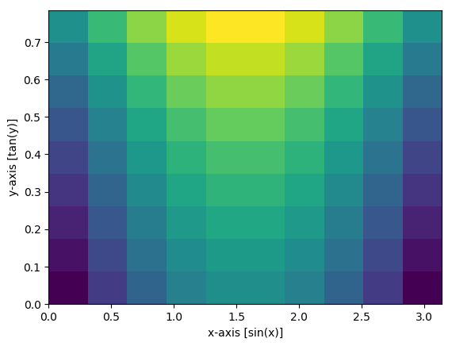
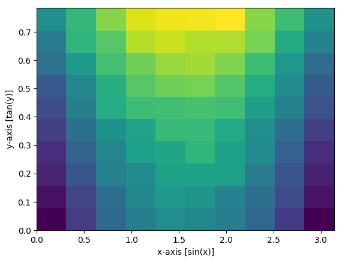
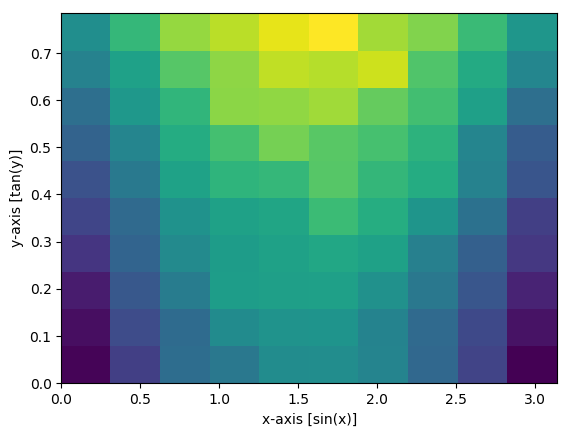

# InterpolatedRejectionSampling.jl
[](https://travis-ci.com/m-wells/InterpolatedRejectionSampling.jl)

## Draw samples from discrete multivariate distributions
For a given discrete (n-dimensional) grid of values (essentially the weights or probabilities) and the vectors that describe the span of the underlying space we can draw samples.
```julia
knots :: NTuple{N,V<:AbstractVector}
prob  :: AbstractArray{T<:Real,N}
```
The interpolation of the space is handled by  [`Interpolations.jl`](https://github.com/JuliaMath/Interpolations.jl)
# A simple example
First we need to setup a discrete distribution
```
julia> X = range(0, π, length=10)
julia> Y = range(0, π/4, length=9)
julia> knots = (X,Y)
julia> prob = [sin(x)+tan(y) for x in X, y in Y]
10×9 Array{Float64,2}:
 0.0          0.0984914  0.198912  0.303347  …  0.668179  0.820679  1.0    
 0.34202      0.440512   0.540933  0.645367     1.0102    1.1627    1.34202
 0.642788     0.741279   0.8417    0.946134     1.31097   1.46347   1.64279
 0.866025     0.964517   1.06494   1.16937      1.5342    1.6867    1.86603
 0.984808     1.0833     1.18372   1.28815      1.65299   1.80549   1.98481
 0.984808     1.0833     1.18372   1.28815   …  1.65299   1.80549   1.98481
 0.866025     0.964517   1.06494   1.16937      1.5342    1.6867    1.86603
 0.642788     0.741279   0.8417    0.946134     1.31097   1.46347   1.64279
 0.34202      0.440512   0.540933  0.645367     1.0102    1.1627    1.34202
 1.22465e-16  0.0984914  0.198912  0.303347     0.668179  0.820679  1.0    
```

We can visualize the probability density matrix like so:
```
julia> using PyPlot
julia> imshow(transpose(prob);
              extent = (knots[1][1], knots[1][end], knots[2][1], knots[2][end]),
              aspect = "auto",
              origin = "lower")
julia> ax = gca()
julia> ax.set_xlabel("x-axis [sin(x)]")
julia> ax.set_ylabel("y-axis [tan(y)]")
```


To perform a sampling
```
julia> using InterpolatedRejectionSampling
julia> n = 100_000
julia> xy = irsample(knots,prob,n)
julia> hist2D(xy[1,:],xy[2,:])
julia> ax = gca()
julia> ax.set_xlabel("x-axis [sin(x)]")
julia> ax.set_ylabel("y-axis [tan(y)]")
```


# In place sampling
Replace half of the coordinates with missing and sample in place.
```
julia> xy = convert(Matrix{Union{Missing,Float64}}, xy)
julia> for i = 1:n
           if iseven(i)
               xy[1,i] = missing
           else
               xy[2,i] = missing
           end
       end
julia> irsample!(xy,knots,prob)
julia> hist2D(xy[1,:],xy[2,:])
julia> ax = gca()
julia> ax.set_xlabel("x-axis [sin(x)]")
julia> ax.set_ylabel("y-axis [tan(y)]")
```


# Benchmarking
This code makes use of caching and computes the envelope for each point to be drawn.
Hence it is memory friendly and is quite fast.
Benchmarking with 100,000 points.
```julia
using BenchmarkTools
for i = 1:n
    if iseven(i)
        xy[1,i] = missing
    else
        xy[2,i] = missing
    end
end
@benchmark irsample!(xy,knots,prob)
```
```
BenchmarkTools.Trial: 
  memory estimate:  29.86 MiB
  allocs estimate:  600029
  --------------
  minimum time:     43.686 ms (4.48% GC)
  median time:      46.023 ms (4.69% GC)
  mean time:        48.114 ms (7.55% GC)
  maximum time:     112.981 ms (51.23% GC)
  --------------
  samples:          104
  evals/sample:     1
```
```julia
using BenchmarkTools
@benchmark irsample(knots,prob,n)
```
```
BenchmarkTools.Trial: 
  memory estimate:  37.66 MiB
  allocs estimate:  735487
  --------------
  minimum time:     27.273 ms (6.16% GC)
  median time:      29.676 ms (11.63% GC)
  mean time:        31.125 ms (11.67% GC)
  maximum time:     100.308 ms (62.43% GC)
  --------------
  samples:          161
  evals/sample:     1
```
```julia
using BenchmarkTools
@benchmark irsample(X,sin.(X),n)
```
```
BenchmarkTools.Trial: 
  memory estimate:  7.19 MiB
  allocs estimate:  143
  --------------
  minimum time:     6.809 ms (0.00% GC)
  median time:      7.327 ms (0.00% GC)
  mean time:        7.811 ms (5.67% GC)
  maximum time:     76.786 ms (87.52% GC)
  --------------
  samples:          640
  evals/sample:     1
```
