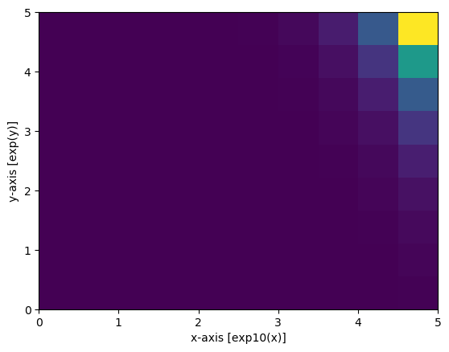
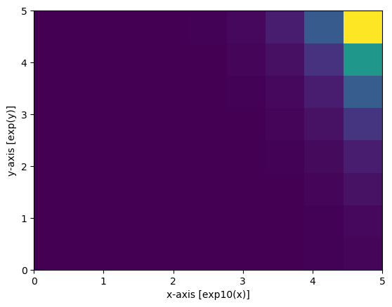

```julia
import Pkg
Pkg.activate("../.")
```


    "/home/mark/devel/InterpolatedRejectionSampling/Project.toml"


```julia
X = range(0, π, length=10)
Y = range(0, π/4, length=9)
knots = (X,Y)
prob = [sin(x)+tan(y) for x in X, y in Y]
```


    10×9 Array{Float64,2}:
     0.0          0.0984914  0.198912  0.303347  …  0.668179  0.820679  1.0    
     0.34202      0.440512   0.540933  0.645367     1.0102    1.1627    1.34202
     0.642788     0.741279   0.8417    0.946134     1.31097   1.46347   1.64279
     0.866025     0.964517   1.06494   1.16937      1.5342    1.6867    1.86603
     0.984808     1.0833     1.18372   1.28815      1.65299   1.80549   1.98481
     0.984808     1.0833     1.18372   1.28815   …  1.65299   1.80549   1.98481
     0.866025     0.964517   1.06494   1.16937      1.5342    1.6867    1.86603
     0.642788     0.741279   0.8417    0.946134     1.31097   1.46347   1.64279
     0.34202      0.440512   0.540933  0.645367     1.0102    1.1627    1.34202
     1.22465e-16  0.0984914  0.198912  0.303347     0.668179  0.820679  1.0    


```julia
using PyPlot
imshow(transpose(prob);
       extent = (knots[1][1], knots[1][end], knots[2][1], knots[2][end]),
       aspect = "auto",
       origin = "lower")
ax = gca()
ax.set_xlabel("x-axis [sin(x)]")
ax.set_ylabel("y-axis [tan(y)]")
;
```


```julia
using InterpolatedRejectionSampling
n = 100_000
xy = irsample(knots,prob,n)
hist2D(xy[1,:],xy[2,:],
       bins=[X,Y])
ax = gca()
ax.set_xlabel("x-axis [sin(x)]")
ax.set_ylabel("y-axis [tan(y)]")
;
```


## throw away every other x or y


```julia
xy = convert(Matrix{Union{Missing,Float64}}, xy)
for i = 1:n
    if iseven(i)
        xy[1,i] = missing
    else
        xy[2,i] = missing
    end
end
irsample!(xy,knots,prob)
hist2D(xy[1,:],xy[2,:],
       bins=[X,Y])
ax = gca()
ax.set_xlabel("x-axis [sin(x)]")
ax.set_ylabel("y-axis [tan(y)]")
;
```


## Benchmarking


```julia
using BenchmarkTools
for i = 1:n
    if iseven(i)
        xy[1,i] = missing
    else
        xy[2,i] = missing
    end
end
@benchmark irsample!(xy,knots,prob)
```


    BenchmarkTools.Trial: 
      memory estimate:  12.33 MiB
      allocs estimate:  200013
      --------------
      minimum time:     5.003 ms (0.00% GC)
      median time:      8.635 ms (26.59% GC)
      mean time:        8.392 ms (21.52% GC)
      maximum time:     78.848 ms (88.96% GC)
      --------------
      samples:          595
      evals/sample:     1


```julia
using BenchmarkTools
@benchmark irsample(knots,prob,n)
```


    BenchmarkTools.Trial: 
      memory estimate:  43.60 MiB
      allocs estimate:  1470663
      --------------
      minimum time:     37.705 ms (13.28% GC)
      median time:      50.029 ms (13.58% GC)
      mean time:        51.103 ms (15.15% GC)
      maximum time:     144.499 ms (57.30% GC)
      --------------
      samples:          98
      evals/sample:     1


```julia
using BenchmarkTools
@benchmark irsample(X,sin.(X),n)
```


    BenchmarkTools.Trial: 
      memory estimate:  7.71 MiB
      allocs estimate:  355344
      --------------
      minimum time:     10.348 ms (0.00% GC)
      median time:      13.885 ms (0.00% GC)
      mean time:        14.703 ms (8.48% GC)
      maximum time:     92.105 ms (83.98% GC)
      --------------
      samples:          340
      evals/sample:     1


# A more aggresive example


```julia
X = range(0, 5, length=10)
Y = range(0, 5, length=9)
knots = (X,Y)
prob = [exp10(x)*exp(y) for x in X, y in Y]
prob ./= maximum(prob)
```


    10×9 Array{Float64,2}:
     6.73795e-8   1.25881e-7   2.35177e-7   …  5.35261e-6   1.0e-5     
     2.42149e-7   4.52394e-7   8.45184e-7      1.92363e-5   3.59381e-5 
     8.70239e-7   1.62582e-6   3.03743e-6      6.91317e-5   0.000129155
     3.12748e-6   5.8429e-6    1.0916e-5       0.000248446  0.000464159
     1.12396e-5   2.09983e-5   3.923e-5        0.00089287   0.0016681  
     4.03929e-5   7.54639e-5   0.000140985  …  0.00320881   0.00599484 
     0.000145165  0.000271203  0.000506674     0.0115319    0.0215443  
     0.000521695  0.000974654  0.00182089      0.0414433    0.0774264  
     0.00187487   0.00350273   0.00654395      0.14894      0.278256   
     0.00673795   0.0125881    0.0235177       0.535261     1.0        


```julia
using PyPlot
imshow(transpose(prob);
       extent = (knots[1][1], knots[1][end], knots[2][1], knots[2][end]),
       aspect = "auto",
       origin = "lower")
ax = gca()
ax.set_xlabel("x-axis [exp10(x)]")
ax.set_ylabel("y-axis [exp(y)]")
;
```





```julia
xy = Matrix{Union{Missing,Float64}}(missing,2,100_000)
irsample!(xy,knots,prob)

hist2D(xy[1,:],xy[2,:], bins=[X,Y])

ax = gca()
ax.set_xlabel("x-axis [exp10(x)]")
ax.set_ylabel("y-axis [exp(y)]")
```





    PyObject Text(24.000000000000007, 0.5, 'y-axis [exp(y)]')


```julia
xy = Matrix{Union{Missing,Float64}}(missing,2,1000)
prob = [exp10(x)*exp(y) for x in X, y in Y]
prob ./= maximum(prob)
irsample!(xy,knots,prob)
@benchmark irsample!(xy,knots,prob)
```


    BenchmarkTools.Trial: 
      memory estimate:  131.70 KiB
      allocs estimate:  2011
      --------------
      minimum time:     52.181 μs (0.00% GC)
      median time:      64.942 μs (0.00% GC)
      mean time:        115.768 μs (28.73% GC)
      maximum time:     88.642 ms (99.88% GC)
      --------------
      samples:          10000
      evals/sample:     1


```julia

```
